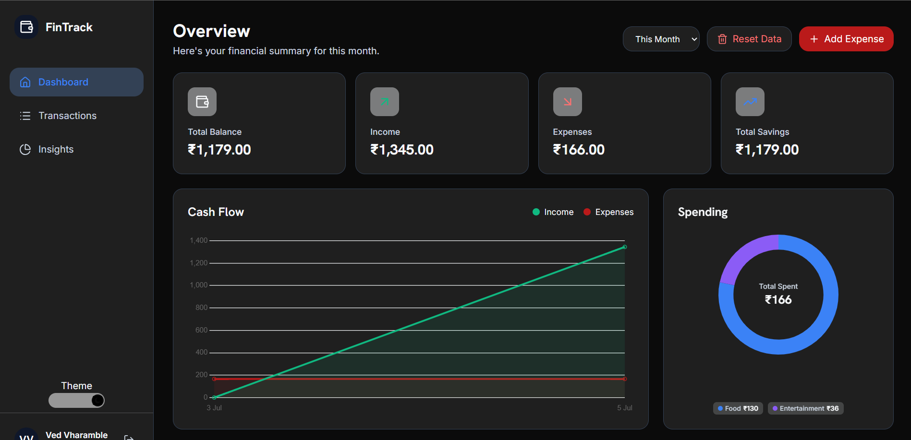

# 💸 Smart Expense Tracker

A full-stack personal finance web application that helps users track expenses, manage budgets, and gain insights into their spending habits.

**Live Demo:** [smart-expense-tracker-20.vercel.app](https://smart-expense-tracker-20.vercel.app)

---

## 📸 Preview



---

## ✨ Features

- 🔐 **Authentication** — Secure register & login with JWT tokens
- 📊 **Expense Tracking** — Add, view, edit and delete expenses by category
- 📈 **Insights** — Visual breakdown of spending by category with budget benchmarks
- 🔔 **Smart Alerts** — Warnings when spending exceeds recommended percentages
- 💾 **Remember Me** — Persistent login using localStorage / sessionStorage
- 📱 **Responsive Design** — Works seamlessly on desktop and mobile

---

## 🛠️ Tech Stack

### Frontend
| Technology | Purpose |
|---|---|
| React + Vite | UI framework |
| React Router | Client-side routing |
| Axios | HTTP requests |
| Lucide React | Icons |
| CSS | Styling |

### Backend
| Technology | Purpose |
|---|---|
| Node.js + Express | REST API server |
| PostgreSQL (Neon) | Database |
| bcrypt | Password hashing |
| JSON Web Tokens | Authentication |
| pg | PostgreSQL client |

### Deployment
| Service | Purpose |
|---|---|
| Vercel | Frontend hosting |
| Render | Backend hosting |
| Neon | Managed PostgreSQL database |

---

## 🗂️ Project Structure

```
Smart-Expense-Tracker/
├── frontend/
│   ├── public/
│   ├── src/
│   │   ├── context/
│   │   │   └── AuthContext.jsx       # Auth state, login, register, logout
│   │   ├── pages/
│   │   │   ├── Login.jsx             # Login & Register page
│   │   │   ├── Dashboard.jsx         # Main expense dashboard
│   │   │   └── Insights.jsx          # Spending insights & charts
│   │   ├── styles/                   # CSS files
│   │   └── main.jsx
│   ├── .env                          # VITE_API_URL (local)
│   ├── vercel.json                   # React Router fix for Vercel
│   └── vite.config.js
│
├── backend/
│   ├── routes/
│   │   ├── auth.js                   # /api/auth/register, /api/auth/login
│   │   └── expenses.js               # /api/expenses CRUD
│   ├── middleware/
│   │   └── auth.js                   # JWT verification middleware
│   ├── db.js                         # PostgreSQL connection pool
│   ├── server.js                     # Express app entry point
│   └── .env                          # DATABASE_URL, JWT_SECRET (local)
│
└── README.md
```

---

## 🌐 Live App

👉 **[Try it here](https://smart-expense-tracker-20.vercel.app)**

Simply register a free account and start tracking your expenses instantly — no installation needed.

---

## 🔒 Security

- Passwords are hashed using **bcrypt**
- Authentication uses **JWT tokens**
- All protected routes require a valid `Authorization: Bearer <token>` header
- Auto-logout on 401/403 responses
- Environment variables used for all secrets — never hardcoded

---

## 🤝 Contributing

Pull requests are welcome! For major changes, please open an issue first to discuss what you'd like to change.

---

## 📄 License

This project is open source and available under the [MIT License](LICENSE).

---

## 👨‍💻 Author

**Ved** — [github.com/VedV2046](https://github.com/VedV2046)
